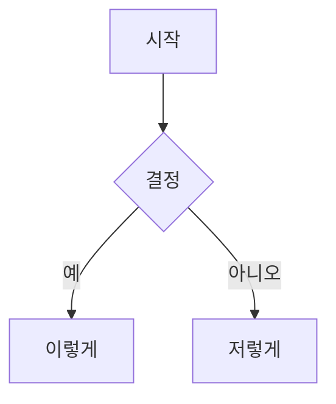

# Obsidian 마크다운 스킬

유효한 Obsidian Flavored Markdown을 생성·편집한다. Obsidian은 CommonMark와 GFM을 기반으로 위키링크, 임베드, 콜아웃, 속성, 주석 등 고유 문법을 추가한다. 이 스킬은 Obsidian 고유 확장 기능만 다룬다 — 표준 마크다운(제목, 굵게, 기울임, 목록, 인용, 코드 블록, 표)은 알고 있다고 가정한다.

## 워크플로우: Obsidian 노트 생성

1. **프론트매터 추가** — 파일 상단에 속성(title, tags, aliases) 작성.
2. **콘텐츠 작성** — 구조에는 표준 마크다운, 아래의 Obsidian 고유 문법 활용.
3. **관련 노트 링크** — 볼트 내부 연결은 위키링크(`[[노트명]]`), 외부 URL은 표준 마크다운 링크.
4. **콘텐츠 임베드** — `![[임베드]]` 문법으로 다른 노트·이미지·PDF 삽입.
5. **콜아웃 추가** — `> [!type]` 문법으로 강조 정보 표시.
6. **검증** — Obsidian 읽기 뷰에서 노트가 올바르게 렌더링되는지 확인.

> 위키링크와 마크다운 링크 선택 기준: 볼트 내 노트는 `[[위키링크]]` 사용(Obsidian이 이름 변경 자동 추적), 외부 URL에만 `[텍스트](url)` 사용.

## 내부 링크 (위키링크)

```markdown
[[노트명]]                              노트 링크
[[노트명|표시 텍스트]]                  커스텀 표시 텍스트
[[노트명#헤딩]]                         헤딩 링크
[[노트명#^블록-id]]                     블록 링크
[[#같은 노트의 헤딩]]                   같은 노트 내 헤딩 링크
```

블록 ID는 문단 뒤에 `^블록-id` 추가로 정의:

```markdown
이 문단에 링크 가능. ^my-block-id
```

## 임베드

위키링크 앞에 `!`를 붙이면 인라인으로 내용 임베드:

```markdown
![[노트명]]                             전체 노트 임베드
![[노트명#헤딩]]                        섹션 임베드
![[이미지.png]]                         이미지 임베드
![[이미지.png|300]]                     너비 지정 이미지 임베드
![[문서.pdf#page=3]]                    PDF 페이지 임베드
```

## 콜아웃

```markdown
> [!note]
> 기본 콜아웃.

> [!warning] 커스텀 제목
> 커스텀 제목이 있는 콜아웃.

> [!faq]- 기본으로 접힘
> 접을 수 있는 콜아웃 (- 접힘, + 펼침).
```

자주 쓰는 타입: `note`, `tip`, `warning`, `info`, `example`, `quote`, `bug`, `danger`, `success`, `failure`, `question`, `abstract`, `todo`.

## 속성 (프론트매터)

```yaml
---
title: 내 노트
date: 2024-01-15
tags:
  - project
  - active
aliases:
  - 대체 이름
cssclasses:
  - custom-class
---
```

기본 속성: `tags`(검색 가능한 레이블), `aliases`(링크 제안용 노트 대체 이름), `cssclasses`(스타일링용 CSS 클래스).

## 태그

```markdown
#태그                   인라인 태그
#중첩/태그              계층 구조 중첩 태그
```

태그는 문자, 숫자(첫 글자 제외), 밑줄, 하이픈, 슬래시 포함 가능.

## 주석

```markdown
이 텍스트는 보임 %%하지만 이건 숨겨짐%%.

%%
이 블록 전체는 읽기 뷰에서 숨겨짐.
%%
```

## Obsidian 고유 서식

```markdown
==강조 텍스트==                         하이라이트 문법
```

## 수식 (LaTeX)

```markdown
인라인: $e^{i\pi} + 1 = 0$

블록:
$$
\frac{a}{b} = c
$$
```

## 다이어그램 (Mermaid)

````markdown

````

## 각주

```markdown
각주가 있는 텍스트[^1].

[^1]: 각주 내용.

인라인 각주.^[이것이 인라인.]
```

## 참고 자료

- [Obsidian Flavored Markdown](https://help.obsidian.md/obsidian-flavored-markdown)
- [내부 링크](https://help.obsidian.md/links)
- [콜아웃](https://help.obsidian.md/callouts)
- [속성](https://help.obsidian.md/properties)
